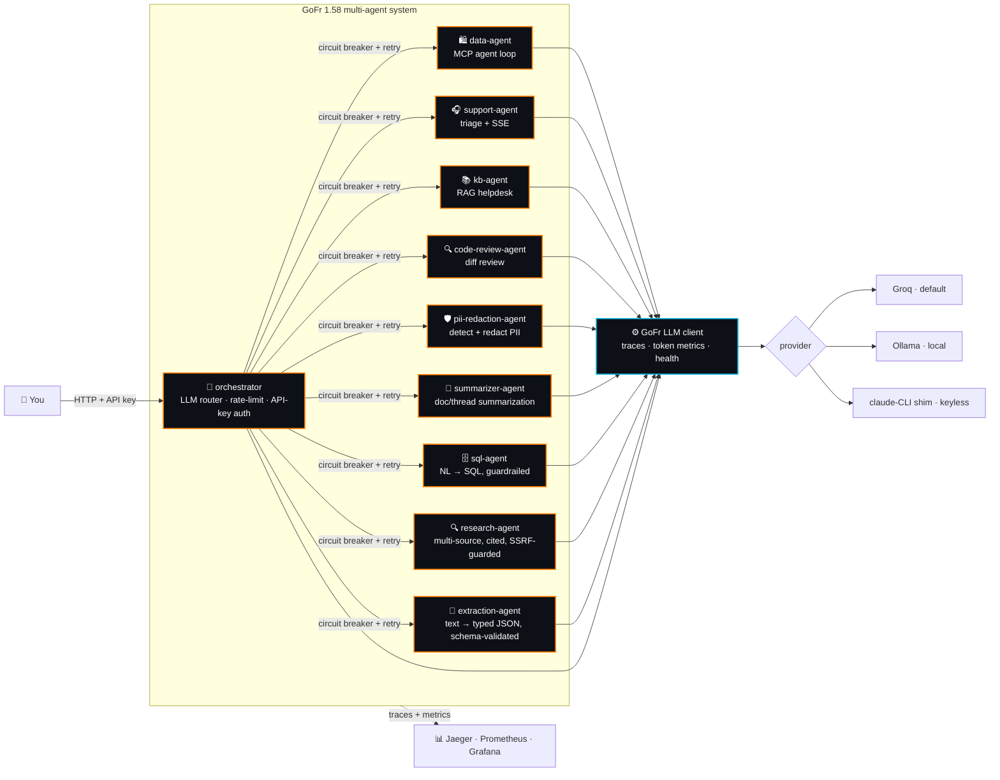
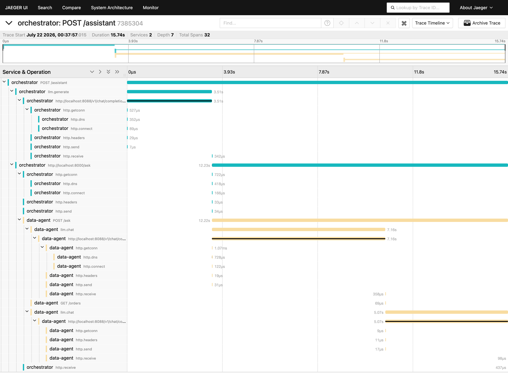
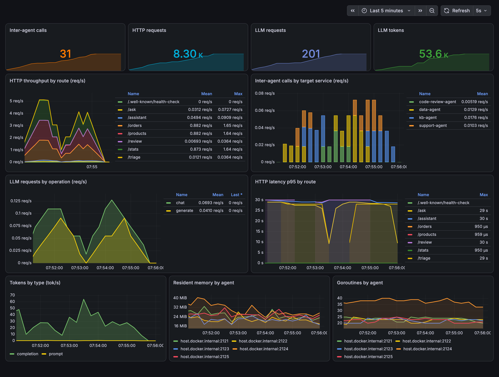
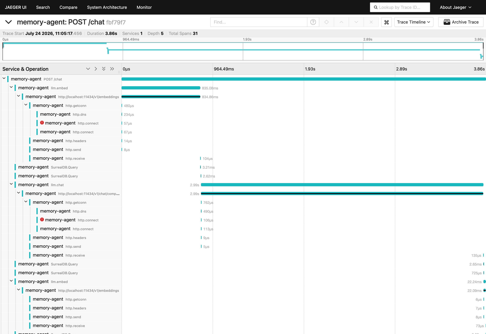
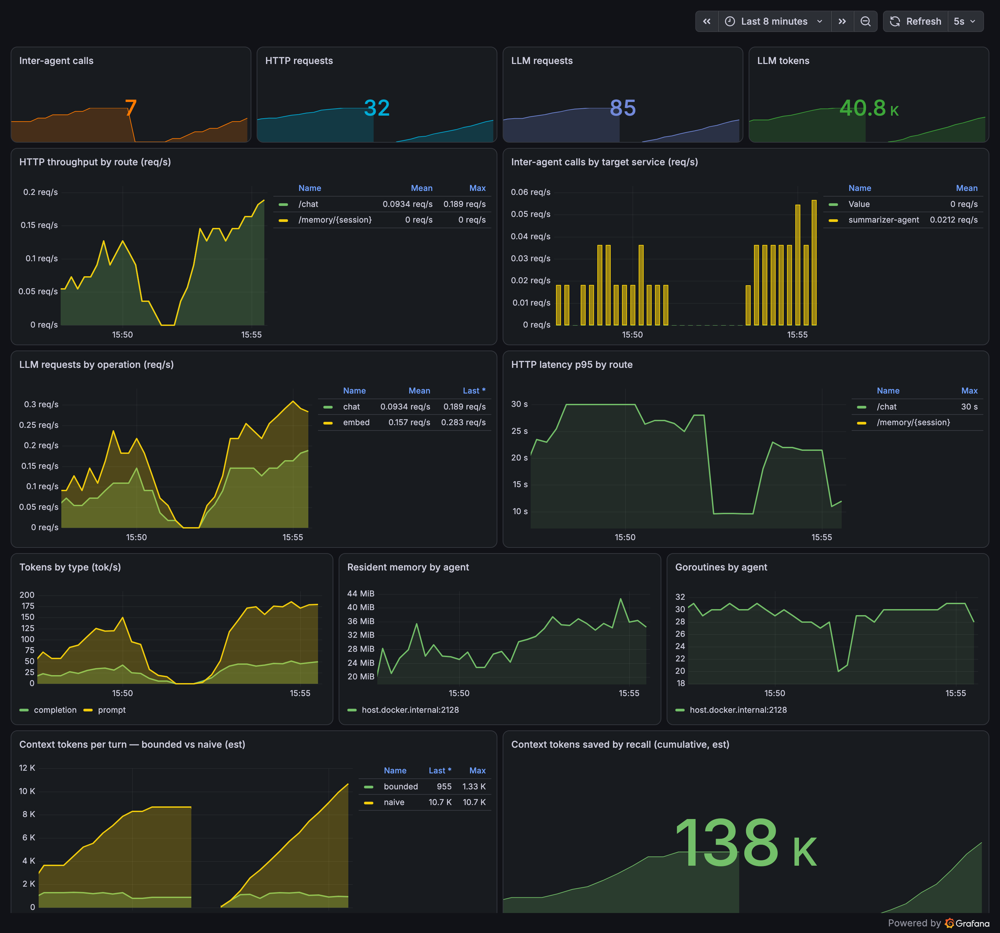

<div align="center">

# 🤖 agents

### A multi-agent system built on **[GoFr](https://gofr.dev) v1.58**

*Specialist agents behind an LLM-routing orchestrator — talking to each other over **resilient**<br/>GoFr HTTP services, with tracing, token metrics, health checks and streaming wired in for free.*

<br/>

[](https://go.dev)
[](https://github.com/gofr-dev/gofr/releases/tag/v1.58.0)
[](LICENSE)
[](https://github.com/aryanmehrotra/agents/pulls)
[](https://github.com/aryanmehrotra/agents/stargazers)

**Runs locally with `no API key` and `no model install`** — via a tiny [claude-CLI shim](localtest/claude-openai-shim).<br/>
Pushed default is **Groq** (free tier); OpenAI / Ollama / any OpenAI-compatible endpoint is a one-line swap.

</div>

---

## 🗺️ Architecture



A request enters the **orchestrator** (rate-limited, API-key protected); an LLM decides which specialist
should handle it; the orchestrator calls that agent over a **circuit-broken, retrying** GoFr HTTP service.
Because every hop is traced, one request is **one distributed trace across services**.

## 🤖 The agents

| Agent | Use case | GoFr 1.58 features it shows |
|-------|----------|-----------------------------|
| 🧭 **[`orchestrator`](orchestrator)** | Routes a query to the right specialist (multi-agent front door) | **inter-service calls** + **circuit breaker** + **retry** + **rate limiter** + **API-key auth** |
| 🛍️ **[`data-agent`](data-agent)** | Ask your own service in natural language | **MCP** (`EnableMCP`) + **agent loop** (`ctx.LLM().Tools()`) |
| 🎧 **[`support-agent`](support-agent)** | Triage a ticket / issue and draft a reply | `ctx.LLM().Chat` + **SSE streaming** |
| 📚 **[`kb-agent`](kb-agent)** | Internal IT/HR helpdesk grounded in your docs (RAG) | retrieval → `ctx.LLM().Chat` + streaming |
| 🔍 **[`code-review-agent`](code-review-agent)** | Review a diff, leave file/line-anchored comments | structured `ctx.LLM().Chat` output + streaming |
| 🛡️ **[`pii-redaction-agent`](pii-redaction-agent)** | Detect and redact PII before text hits storage/logs | LLM-detect + deterministic Go redaction, streamed rationale |
| 📝 **[`summarizer-agent`](summarizer-agent)** | Summarize a long document / email / chat thread | structured `ctx.LLM().Chat` output + streaming |
| 🧠 **[`memory-agent`](memory-agent)** | Conversational agent with real long-term memory over a **stateless** model | **`Embedder`** (`ctx.LLM("embed").Embed`) + **SurrealDB** vector recall |
| 🗄️ **[`sql-agent`](sql-agent)** | Ask a database in natural language; SQL runs for real, guardrailed | zero-config **`c.SQL`** datasource + LLM-generated, read-only-checked SQL |
| 🔍 **[`research-agent`](research-agent)** | Multi-source web research with inline `[n]` citations | real outbound fetch + SSRF-guarded URL allowlist logic, `ctx.LLM().Chat` synthesis |
| 🧩 **[`extraction-agent`](extraction-agent)** | Turn unstructured text into structured, typed JSON against a declared schema | `ctx.LLM().Chat` + deterministic Go schema/type validation of the model's output |

> Each agent is its **own Go module** — copy one out and run it standalone.
> `memory-agent` is the one that needs a **real** model (a stateless chat model + a real embeddings
> model) — run it against [Ollama](https://ollama.com) or OpenAI; see its [README](memory-agent). The
> others run keyless via the shim.

---

## ⚡ Quickstart — keyless, local, end-to-end

No key. No Ollama. The shim answers via your local `claude` CLI.

```bash
# 1 · start the shim (leave it running)
cd localtest/claude-openai-shim && go run .          # :8088

# 2 · start the specialists + orchestrator (each in its own shell)
for a in data-agent support-agent kb-agent code-review-agent pii-redaction-agent summarizer-agent sql-agent research-agent extraction-agent orchestrator; do
  ( cd $a && cp configs/.env.local configs/.env && go run . ) &
done

# 3 · ask the front door (API key required) — the LLM routes it for you
curl -s localhost:8080/assistant -H 'X-Api-Key: agents-demo-key' \
  -d '{"query":"Which products are out of stock and what is our shipped revenue?"}'
```

```jsonc
// the orchestrator classified the query, called data-agent over a resilient HTTP service,
// which ran its own MCP agent loop — all in one distributed trace:
{ "route": "data", "routed_to": "data-agent",
  "response": { "data": { "answer": "Out of stock: 4K Monitor (p4). Shipped revenue: $3,240." } } }
```

Run a single agent directly with **Groq** instead: `cp configs/.env.example configs/.env`, add
`GROQ_API_KEY` (free at [console.groq.com/keys](https://console.groq.com/keys)), `go run .`

### Provider matrix

| Provider | `.env` |
|----------|--------|
| 🟢 **Groq** *(default)* | `LLM_PROVIDER=groq` · `LLM_MODEL=llama-3.3-70b-versatile` · `GROQ_API_KEY=…` |
| ⚪ OpenAI | `LLM_PROVIDER=openai` · `LLM_MODEL=gpt-4o-mini` · `OPENAI_API_KEY=…` |
| 🦙 Ollama *(local)* | `LLM_PROVIDER=ollama` · `LLM_MODEL=llama3.1` · `LLM_BASE_URL=http://localhost:11434/v1` |
| 🧪 claude shim *(this repo)* | `LLM_PROVIDER=openai` · `LLM_BASE_URL=http://localhost:8088/v1` · any key |

---

## 🧩 GoFr features on the wire

The multi-agent setup isn't just LLM calls — it leans on GoFr's batteries so the handlers stay tiny:

```go
// orchestrator: each specialist is a resilient HTTP service — no handler code for any of this
app.AddHTTPService("data-agent", "http://localhost:8000",
    &service.CircuitBreakerConfig{Threshold: 4, Interval: 2 * time.Second},
    &service.RateLimiterConfig{Requests: 20, Window: time.Second, Burst: 25},
    &service.HealthConfig{HealthEndpoint: ".well-known/health-check"},
)
app.EnableAPIKeyAuth("agents-demo-key")   // front-door auth

// data-agent: your own endpoints become the agent's tools
app.EnableMCP()
tools := c.LLM().Tools()
resp, _ := c.LLM().Chat(c, msgs, ai.WithTools(tools.List()))
```

**Circuit breaker · retry · rate limiter · health check · API-key auth · MCP · SSE streaming** — all
from GoFr, all observable.

---

## 📊 Observability — the complete story

Every LLM call, tool call and inter-agent hop is traced and measured with **zero extra code**. Spin up
the [local stack](observability) and watch it live:

```bash
docker compose -f observability/docker-compose.yml up -d   # Jaeger + Prometheus + Grafana
```

**One `/assistant` request = one distributed trace across two services.** The orchestrator's routing
`llm.generate`, the inter-agent call, and `data-agent`'s full agent loop (`llm.chat` + tool calls) —
**32 spans, 2 services, depth 7** — in a single Jaeger trace (teal = orchestrator, yellow = data-agent):



**A pre-provisioned Grafana dashboard** — inter-agent calls by target, HTTP throughput & p95 latency,
LLM requests by operation, tokens/s, and per-agent memory & goroutines, straight from GoFr's metrics:



**Embeddings are first-class here too.** The `memory-agent`'s vector-recall embed calls ride the same
instrumentation as chat, so one `POST /chat` trace shows the full memory turn — recall embed →
SurrealDB lookup → chat → SurrealDB writes → the stored-fact embed — and the dashboard breaks LLM
requests down **by operation** (`embed` beside `chat`) *and* charts the memory payoff: bounded vs
naive context tokens per turn, and the **cumulative tokens saved** by recall (176K and climbing in
the run below):




<sub>The *inter-agent* panels show memory-agent → summarizer-agent calls (it compacts old turns into summaries once a session outgrows the window).</sub>

See [`observability/`](observability) to run it yourself. Prompt/response text is kept **off** metrics
and logs by design.

---

## 🗂️ Layout

```
agents/
├── 🧭 orchestrator/     LLM router → specialists (circuit breaker/retry/auth)  :8080
├── 🛍️ data-agent/       MCP agent loop over its own endpoints                  :8000  (MCP :8200)
├── 🎧 support-agent/    ticket triage + SSE reply                              :8001
├── 📚 kb-agent/         RAG helpdesk over ./kb                                  :8002
├── 🔍 code-review-agent/ structured diff review + streamed prose review         :8003
├── 🛡️ pii-redaction-agent/ LLM-detect + deterministic redact + streamed rationale :8004
├── 📝 summarizer-agent/ structured breakdown + streamed narrative summary          :8005
├── 🧠 memory-agent/     stateless model + SurrealDB vector memory (Embedder)      :8006
├── 🗄️ sql-agent/        NL → SQL over a zero-config datasource, guardrailed        :8007
├── 🔍 research-agent/   multi-source web research, cited, SSRF-guarded fetch          :8008
├── 🧩 extraction-agent/ unstructured text → typed JSON, schema-validated in Go        :8009
├── 📊 observability/    docker-compose: Jaeger + Prometheus + Grafana
└── 🧪 localtest/
    └── claude-openai-shim/   OpenAI-compatible endpoint via the claude CLI     :8088
```

---

<div align="center">

Built with **[GoFr](https://github.com/gofr-dev/gofr)** · [v1.58.0 release notes](https://github.com/gofr-dev/gofr/releases/tag/v1.58.0)

<sub>If this helped, a ⭐ is appreciated.</sub>

</div>
