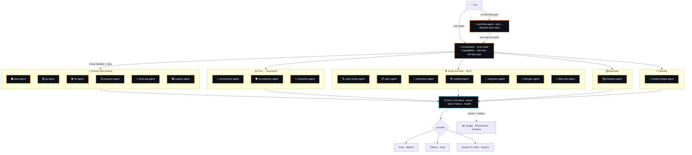
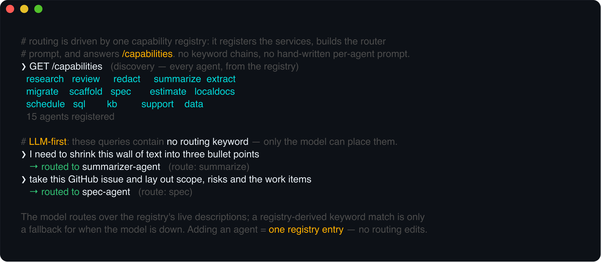

<div align="center">

# 🤖 agents

### A multi-agent system built on **[GoFr](https://gofr.dev) v1.58**

*Specialist agents behind an LLM-routing orchestrator — talking to each other over **resilient**<br/>GoFr HTTP services, with tracing, token metrics, health checks and streaming wired in for free.*

<br/>

[](https://go.dev)
[](https://github.com/gofr-dev/gofr/releases/tag/v1.58.0)
[](LICENSE)
[](https://github.com/aryanmehrotra/agents/pulls)
[](https://github.com/aryanmehrotra/agents/stargazers)

**Runs locally with `no API key` and `no model install`** — via a tiny [claude-CLI shim](localtest/claude-openai-shim).<br/>
Pushed default is **Groq** (free tier); OpenAI / Ollama / any OpenAI-compatible endpoint is a one-line swap.

</div>

---

## 🗺️ Architecture



A request enters the **orchestrator** (rate-limited, API-key protected); an LLM decides which specialist
should handle it; the orchestrator calls that agent over a **circuit-broken, retrying** GoFr HTTP service.
Because every hop is traced, one request is **one distributed trace across services**.

Routing is **registry-driven and LLM-first**: a single [capability registry](orchestrator/main.go)
declares each agent's route, request shape and a description, and that one list drives the
resilient-service registration, the router prompt (generated from the live descriptions — the model
picks over them, so no hand-maintained prompt), and a **`GET /capabilities`** discovery endpoint. A
registry-derived keyword match is only a fallback for when the model is unavailable. **Adding an agent
is one registry entry — no keyword chains or prompt prose to edit.**



## 🤖 The agents

20 specialists, each its **own Go module** you can run standalone. The recurring pattern: **the model
proposes, Go disposes** — a deterministic guardrail validates every answer.

🧭 **[`orchestrator`](orchestrator)** — the front door. Routes any query to the right agent, **LLM-first**
over a [capability registry](orchestrator), with a `/capabilities` discovery endpoint.

**🔎 Answer & retrieve**
- **[`data-agent`](agents/retrieval/data-agent)** — ask your own service in natural language (MCP tool loop)
- **[`sql-agent`](agents/retrieval/sql-agent)** — ask a database; guardrailed read-only SQL runs for real
- **[`kb-agent`](agents/retrieval/kb-agent)** — IT/HR helpdesk grounded in your docs (RAG)
- **[`research-agent`](agents/retrieval/research-agent)** — multi-source web research, cited, SSRF-guarded
- **[`local-rag-agent`](agents/retrieval/local-rag-agent)** — 100% on-device RAG (llama.cpp + SurrealDB)
- **[`support-agent`](agents/retrieval/support-agent)** — triage a ticket, draft a reply (SSE)
- **[`memory-agent`](agents/retrieval/memory-agent)** — long-term memory over a stateless model (vector recall)

**✍️ Text → structured**
- **[`summarizer-agent`](agents/text/summarizer-agent)** — tl;dr + key points, structured & streamed
- **[`pii-redaction-agent`](agents/text/pii-redaction-agent)** — detect + redact PII, deterministically in Go
- **[`extraction-agent`](agents/text/extraction-agent)** — text → typed JSON against your schema

**🏗️ Build & ship — the SDLC suite**
- **[`code-review-agent`](agents/sdlc/code-review-agent)** — review a diff, file/line-anchored
- **[`spec-agent`](agents/sdlc/spec-agent)** — ticket → structured spec, gated on real criteria
- **[`estimation-agent`](agents/sdlc/estimation-agent)** — size work; **all arithmetic done in Go**
- **[`scaffold-agent`](agents/sdlc/scaffold-agent)** — spec → runnable skeleton, **any stack**
- **[`migration-agent`](agents/sdlc/migration-agent)** — codemod across files, re-parsed so it can't corrupt
- **[`test-gen-agent`](agents/sdlc/test-gen-agent)** — writes tests, then **compiles + runs** them
- **[`flaky-test-agent`](agents/sdlc/flaky-test-agent)** — mines CI history for flaky tests, **detected in Go**

**🗓️ Automate & compose**
- **[`scheduler-agent`](agents/automation/scheduler-agent)** — natural language → a task that actually fires later
- **[`workflow-agent`](agents/automation/workflow-agent)** — one goal → a multi-step plan across the fleet

**🚨 Operate**
- **[`incident-triage-agent`](agents/ops/incident-triage-agent)** — alert/stack trace → root cause, severity, owning team — severity floor + owner routing **guardrailed in Go**

> **Keyless via the shim**, except `memory-agent` (needs a real chat + embed model) and `local-rag-agent`
> (on-device llama.cpp + SurrealDB) — both fully local, see their READMEs.
> 📗 **[GUIDE.md](GUIDE.md)** — customise any agent and compose them.

---

## ⚡ Quickstart — keyless, local, end-to-end

No key. No Ollama. The shim answers via your local `claude` CLI.

```bash
# 1 · start the shim (leave it running)
cd localtest/claude-openai-shim && go run .          # :8088

# 2 · start every specialist + the orchestrator (each its own module, in its own shell)
for a in agents/retrieval/* agents/text/* agents/sdlc/* agents/automation/* agents/ops/* orchestrator; do
  ( cd "$a" && cp configs/.env.local configs/.env && go run . ) &
done

# 3 · ask the front door (API key required) — the LLM routes it for you
curl -s localhost:8080/assistant -H 'X-Api-Key: agents-demo-key' \
  -d '{"query":"Which products are out of stock and what is our shipped revenue?"}'
```

```jsonc
// the orchestrator classified the query, called data-agent over a resilient HTTP service,
// which ran its own MCP agent loop — all in one distributed trace:
{ "route": "data", "routed_to": "data-agent",
  "response": { "data": { "answer": "Out of stock: 4K Monitor (p4). Shipped revenue: $3,240." } } }
```

Run a single agent directly with **Groq** instead: `cp configs/.env.example configs/.env`, add
`GROQ_API_KEY` (free at [console.groq.com/keys](https://console.groq.com/keys)), `go run .`

### Provider matrix

| Provider | `.env` |
|----------|--------|
| 🟢 **Groq** *(default)* | `LLM_PROVIDER=groq` · `LLM_MODEL=llama-3.3-70b-versatile` · `GROQ_API_KEY=…` |
| ⚪ OpenAI | `LLM_PROVIDER=openai` · `LLM_MODEL=gpt-4o-mini` · `OPENAI_API_KEY=…` |
| 🦙 Ollama *(local)* | `LLM_PROVIDER=ollama` · `LLM_MODEL=llama3.1` · `LLM_BASE_URL=http://localhost:11434/v1` |
| 🧪 claude shim *(this repo)* | `LLM_PROVIDER=openai` · `LLM_BASE_URL=http://localhost:8088/v1` · any key |

---

## 🧩 GoFr features on the wire

The multi-agent setup isn't just LLM calls — it leans on GoFr's batteries so the handlers stay tiny:

```go
// orchestrator: each specialist is a resilient HTTP service — no handler code for any of this
app.AddHTTPService("data-agent", "http://localhost:8000",
    &service.CircuitBreakerConfig{Threshold: 4, Interval: 2 * time.Second},
    &service.RateLimiterConfig{Requests: 20, Window: time.Second, Burst: 25},
    &service.HealthConfig{HealthEndpoint: ".well-known/health-check"},
)
app.EnableAPIKeyAuth("agents-demo-key")   // front-door auth

// data-agent: your own endpoints become the agent's tools
app.EnableMCP()
tools := c.LLM().Tools()
resp, _ := c.LLM().Chat(c, msgs, ai.WithTools(tools.List()))
```

**Circuit breaker · retry · rate limiter · health check · API-key auth · MCP · SSE streaming** — all
from GoFr, all observable.

---

## 📊 Observability

Every LLM call, tool call and inter-agent hop is traced and measured with **zero extra code**.

```bash
docker compose -f observability/docker-compose.yml up -d   # Jaeger + Prometheus + Grafana
```

**One `/assistant` request = one distributed trace across services** — the orchestrator's routing, the
inter-agent call, and the specialist's full agent loop: 32 spans, 2 services, depth 7.


A **pre-provisioned Grafana dashboard** — inter-agent calls, HTTP throughput & p95, LLM requests by
operation, tokens/s, per-agent memory & goroutines — straight from GoFr's metrics:


**Embeddings are first-class too** — `memory-agent`'s vector recall rides the same instrumentation, so
one trace shows the whole memory turn (recall → SurrealDB → chat → writes), and the dashboard charts
the payoff: **176K tokens saved** by recall vs naive context, and climbing.


<sub>Prompt/response text is kept **off** metrics and logs by design. See [`observability/`](observability) to run it.</sub>

---

<details>
<summary><b>🗂️ Ports & layout</b></summary>

| Port | Agent | | Port | Agent |
|--|--|--|--|--|
| 8080 | orchestrator | | 8009 | extraction-agent |
| 8000 | data-agent (MCP 8200) | | 8010 | local-rag-agent |
| 8001 | support-agent | | 8011 | scheduler-agent |
| 8002 | kb-agent | | 8012 | workflow-agent |
| 8003 | code-review-agent | | 8013 | spec-agent |
| 8004 | pii-redaction-agent | | 8014 | estimation-agent |
| 8005 | summarizer-agent | | 8015 | scaffold-agent |
| 8006 | memory-agent | | 8016 | migration-agent |
| 8007 | sql-agent | | 8017 | test-gen-agent |
| 8008 | research-agent | | 8018 | flaky-test-agent |
| | | | 8019 | incident-triage-agent |
| | | | 8088 | claude-openai-shim |

Each agent is **its own directory and Go module**, grouped by capability:

```
orchestrator/          front door (LLM router + /capabilities)
agents/
├── retrieval/         data · sql · kb · research · local-rag · support · memory
├── text/              summarizer · pii-redaction · extraction
├── sdlc/              code-review · spec · estimation · scaffold · migration · test-gen · flaky-test
├── automation/        scheduler · workflow
└── ops/               incident-triage
observability/         docker-compose: Jaeger + Prometheus + Grafana
localtest/             the keyless claude-openai-shim
```

</details>

---

<div align="center">

Built with **[GoFr](https://github.com/gofr-dev/gofr)** · [v1.58.0 release notes](https://github.com/gofr-dev/gofr/releases/tag/v1.58.0)

<sub>If this helped, a ⭐ is appreciated.</sub>

</div>
