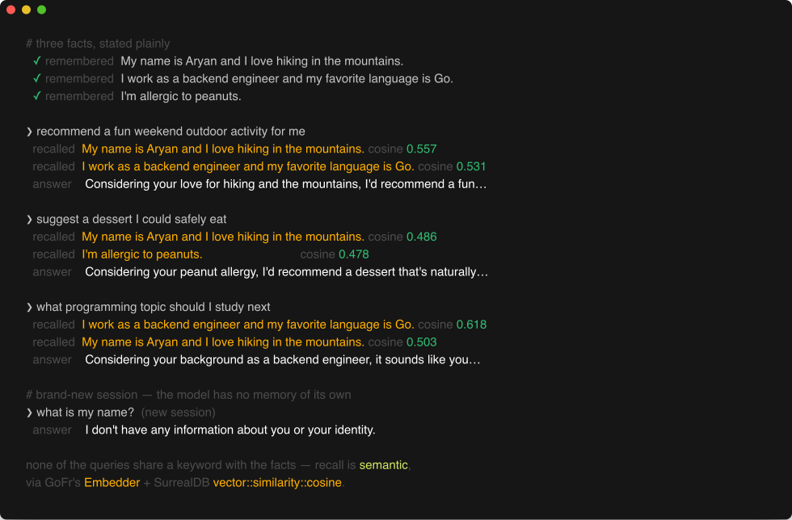
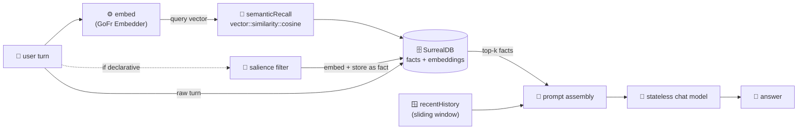

# memory-agent

A conversational agent with **real long-term memory**, built on **GoFr 1.58 + SurrealDB**. The
chat model itself is **stateless** — every request starts from a blank slate. Memory is supplied by
the agent: it embeds what you say, stores it in SurrealDB, and recalls the relevant pieces by vector
similarity on the next turn. This is the pattern behind "assistants that remember you" — decoupled
from any single provider's proprietary memory.

Two layers, one store:

| Layer | What it is | How it's fetched |
|-------|------------|------------------|
| **Working memory** | the last few raw turns | replayed by recency (a sliding window) |
| **Long-term memory** | durable facts you stated earlier | recalled by **vector similarity**, even when the words don't match |

The facts are embedded with GoFr's **`Embedder`** capability (`ctx.LLM("embed").(ai.Embedder)`) and
searched with SurrealDB's `vector::similarity::cosine` — so "suggest a dessert I could safely eat"
recalls *"I'm allergic to peanuts"* that you mentioned twenty turns ago.



<sub>A real run against the live agent — reproduce it with [`docs/recall-demo.sh`](docs/recall-demo.sh) once the stack is up.</sub>

## How it works



On each turn the agent:

1. **embeds** the incoming message as a search *query* (nomic asymmetric prefix `search_query:`),
2. pulls **working memory** (recent turns) and **long-term memory** (top-k similar facts) from SurrealDB,
3. asks the **stateless** chat model with both memories in context,
4. stores the raw turns for the window, and — only if the turn *states a durable fact* (a cheap
   salience filter, not a question or request) — embeds it as a `search_document:` and stores it as a
   searchable **fact**.

Storing only declarative statements keeps recall clean: your own questions never come back as if they
were things you told the agent.

## Endpoints

| Method | Path | Purpose |
|--------|------|---------|
| POST | `/chat` | `{session_id, message}` → `{answer, recalled:[{content, score}], context_tokens:{bounded, naive, saved}}` — `recalled` shows which memories were used; `context_tokens` shows the token savings (below) |
| GET | `/memory/{session}` | dump everything stored for a session |

## What it saves

Giving a model long-term memory the naive way means re-sending the **entire transcript** on every
turn — so prompt tokens grow every turn, and cost grows *quadratically* over a conversation. The
vector-DB approach sends only a **bounded** prompt (a 6-turn window + top-K recalled facts), so prompt
size stays flat no matter how long the conversation runs. The agent measures both and reports the gap:

```jsonc
// turn 35 of one conversation
"context_tokens": { "bounded": 1061, "naive": 11450, "saved": 10389 }
```

It's honest about the trade-off: for the first few turns (still inside the window) `saved` is `0`, and
the embed calls cost a little; the savings only kick in once history exceeds the window, then compound.
Both estimates are emitted as metrics (`app_memory_prompt_tokens{mode}`,
`app_memory_context_tokens_saved`) and charted in the [dashboard](../../../observability) — see below.

## Run

Memory needs a **stateless** chat model and a **real** embedding model, so this agent uses
[Ollama](https://ollama.com) locally (the claude-shim's chat carries state and its embeddings are
lexical). Small models keep RAM low:

```bash
ollama pull llama3.2:1b        # ~1.3 GB — stateless chat
ollama pull nomic-embed-text   # ~275 MB — 768-dim embeddings

# SurrealDB (single store for both memory layers)
docker run --rm -p 8010:8000 surrealdb/surrealdb:latest \
  start --user root --pass root memory

cp configs/.env.local configs/.env && go run .
```

## Try it

```bash
S=demo-1
say() { curl -s localhost:8006/chat -d "{\"session_id\":\"$S\",\"message\":\"$1\"}"; }

say "My name is Aryan and I love hiking in the mountains."
say "I work as a backend engineer and my favorite language is Go."
say "I'm allergic to peanuts."

# paraphrases — none share keywords with the stored facts:
say "recommend a fun weekend outdoor activity for me"
# → recalled: "I love hiking in the mountains" (0.56)
#   answer:   "Considering your love for hiking… mountain biking…"

say "suggest a dessert I could safely eat"
# → recalled: "I'm allergic to peanuts" (0.48)
#   answer:   "Considering your peanut allergy…"
```

The base model is stateless — start a **new** `session_id` and it genuinely won't know your name.
The memory is entirely the agent's, in SurrealDB.

## Compaction — the one inter-agent call

Once a session grows past a threshold, memory-agent keeps stored history bounded by **compacting**:
it sends everything older than the working window to the **[summarizer-agent](../../text/summarizer-agent)**
over a resilient GoFr HTTP service (`ctx.GetHTTPService("summarizer-agent")`, circuit-broken), stores
the returned summary as one recallable memory, and deletes the raw turns. So the gist of old
conversation survives (embedded, recallable) without keeping every turn around — and this is the
inter-agent traffic you see on the dashboard. It's **best-effort**: if the summarizer is down, the
error is logged and the chat is unaffected.

Compaction needs the summarizer-agent running (point `SUMMARIZER_AGENT_URL` at it; defaults to
`http://localhost:8005`). Everything else works without it.

## Observability — embeddings show up too

Because `Embed` rides GoFr's LLM instrumentation, the embedding calls are traced and metered
identically to chat — no extra wiring. Start the stack and every turn is fully observable:

```bash
cd ../../../observability && docker-compose up -d   # Jaeger :16686 · Grafana :3000 · Prometheus :9090
```

A single `POST /chat` trace tells the whole memory story — recall embed → SurrealDB lookup →
chat → SurrealDB writes → the fact embed:


The dashboard breaks LLM requests down **by operation** (`embed` beside `chat`), counts the
**inter-agent calls** to the summarizer-agent (compaction), and — bottom row — charts the memory
payoff directly: **bounded vs naive context tokens** per turn (bounded stays flat while naive climbs)
and the **cumulative tokens saved**:


<sub>Inter-agent calls are memory-agent → summarizer-agent (compaction, above).</sub>

## The GoFr piece

The embeddings call is a first-class GoFr capability added for this agent — an optional `Embedder`
interface next to the frozen `Model`/`LLM` interfaces, so `POST /v1/embeddings` on any
OpenAI-compatible provider (Ollama, OpenAI, …) is reachable as `ctx.LLM("embed").(ai.Embedder)`
with the same tracing and token metrics as chat. See the accompanying GoFr contribution.
