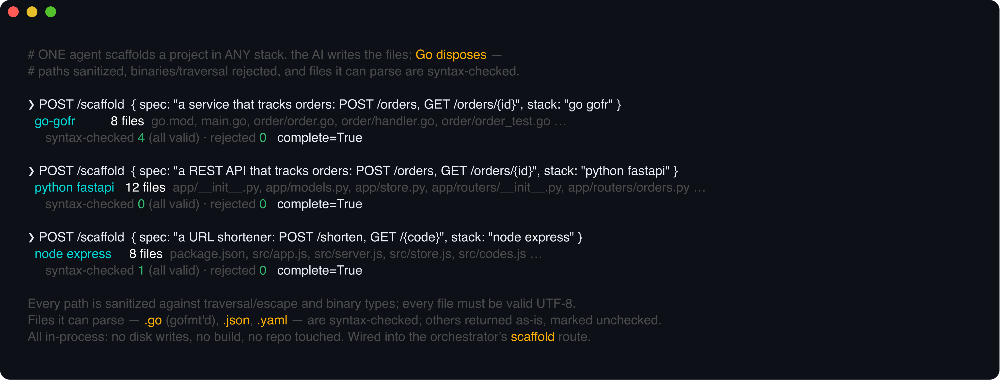
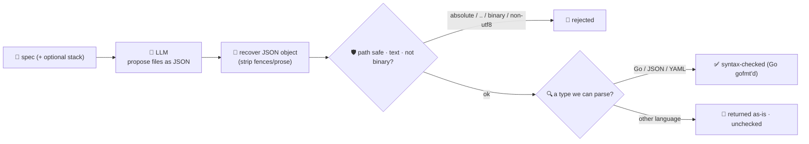

# scaffold-agent

Generates a **runnable project skeleton from a spec — in any language or framework**. Give it
`"a REST API that tracks orders"` and, optionally, a stack (`"python fastapi"`, `"node express"`,
`"rust axum"`, `"go gofr"`, …) and it returns the files — an entry point, the routes/modules the spec
implies, a manifest, a test — ready to drop into a new project. Scaffolding is the **build** stage of
the software-development lifecycle: the repetitive first hour of a new service, done in seconds,
whatever you build in.

The catch is that generated files are only worth anything if they're **safe and real**. A model will
happily emit a file written to `../../etc/passwd`, a binary blob, or truncated source. So the model
only proposes files; **Go disposes of the unsafe and the unusable** before anything leaves the
service — and every part of that is **language-agnostic**:

- **every path is sanitized** — absolute paths, `..`/escape, and binary/executable file types are
  **rejected**, and every file must be **valid UTF-8 text** (a filesystem analogue of the SSRF guard
  the fetch agents use);
- **files we can parse are syntax-checked** — Go via `go/format.Source` (and returned **gofmt'd**),
  JSON via `encoding/json`, YAML via `yaml.v3` — a file that fails is flagged with the parse error.
  Files in a language we can't parse here are returned untouched and honestly marked **unchecked**.

It's all **in-process** — no disk writes, no build, no network — so the agent **never touches your
repo and never blocks**. You get back the files (with per-file validity), an honest list of what was
rejected, and a summary, to write out yourself.



## How it works



## Endpoints

| Method | Path | Purpose |
|--------|------|---------|
| POST | `/scaffold` | `{spec, stack?, module?}` → `{stack, files, rejected, verify, complete}`. `files` each carry `{path, content, bytes, checked, valid}`; `verify` reports `files_generated` / `syntax_checked` / `syntax_invalid` / `all_checked_valid`; `complete` is true when at least one file was kept and nothing we *could* check was broken. Omit `stack` and the model infers a sensible one from the spec. |

## The guardrail (all language-agnostic)

- **Path safety** — a path must be relative and stay inside the scaffold root. Absolute paths, drive
  letters, and any `..` that climbs out are rejected; interior `..` that stays in-root is collapsed.
  Binary/executable extensions (`.exe`, `.so`, `.class`, `.png`, …) are rejected, and every file's
  content must be valid UTF-8. File count, entry count and per-file size are capped.
- **Best-effort syntax verification** — the files this service can parse are checked: **Go** through
  `go/format.Source` (which parses *and* reformats), **JSON** through `encoding/json`, **YAML** through
  `yaml.v3`. Anything broken comes back `valid: false` with the parser's error. A file in a language
  we can't parse here (Python, Rust, JS, …) is returned untouched with `checked: false` — honestly
  unchecked, never silently blessed. This stays in-process, instant, and safe to run anywhere.

## Run

```bash
# keyless (start ../../../localtest/claude-openai-shim first)
cp configs/.env.local configs/.env && go run .

# or with Groq
cp configs/.env.example configs/.env   # add GROQ_API_KEY
go run .
```

## Try it

The **same agent** scaffolds any stack — just name it (or let the model pick):

```bash
# Python / FastAPI
curl -s localhost:8015/scaffold -H 'Content-Type: application/json' \
  -d '{"spec":"A REST API that tracks orders: POST /orders, GET /orders/{id}.","stack":"python fastapi"}'
# → {"stack":"python fastapi","files":[{"path":"app/main.py","checked":false,"valid":true,...}, ...],
#     "verify":{"files_generated":12,"syntax_checked":0,"all_checked_valid":true}, "rejected":[], "complete":true}

# Node / Express — its package.json is JSON-validated
curl -s localhost:8015/scaffold -d '{"spec":"A URL shortener with POST /shorten and GET /{code}.","stack":"node express"}'

# Go / GoFr — every .go file is parsed and returned gofmt'd
curl -s localhost:8015/scaffold -d '{"spec":"A service that tracks orders.","stack":"go gofr"}'
```

Write the returned files out and the project is there — nothing was written for you:

```bash
curl -s localhost:8015/scaffold -d '{"spec":"..."}' \
  | jq -r '.data.files[] | "=== \(.path) ===\n\(.content)"'   # inspect, then redirect into a new dir
```

The **guardrail — not the model's discipline — is what makes the output safe**: a path like
`../secrets.py` or `payload.exe` comes back under `rejected` (never in `files`), a non-UTF-8 blob is
rejected, and a `.go`/`.json`/`.yaml` file the model broke comes back `valid: false` with the parse
error, so `complete` is `false` and you know not to trust it. See `main_test.go` for the unit tests:
path traversal/absolute/drive-letter/binary rejection, per-type verification (Go/JSON/YAML valid and
broken), the honestly-unchecked path for other languages, non-UTF-8 rejection, and JSON recovery.

## Customising

Everything is config-driven and generic — no hard-coded model, key, path, or language:

- **Provider / model** — set `LLM_PROVIDER` / `LLM_MODEL` (+ key) in `configs/.env`. Groq, OpenAI,
  Ollama, or any OpenAI-compatible endpoint is a one-line swap; the shim needs no key.
- **Target stack** — pass `stack` per request, or leave it out and let the model infer. The one system
  prompt is stack-neutral; nothing about Go is baked into the generation.
- **Guardrail policy** — `deniedExt`, `maxFiles`, `maxEntries`, `maxFileBytes` in `main.go` set the
  binary denylist and caps; `safePath` is the traversal guard; `verifyFile` is where you add a checker
  for another language (e.g. `python -m py_compile`, `tsc --noEmit`) if you want to verify more types.

## Observability

Every scaffold is one `llm.chat` span with token metrics, exported by GoFr's configured tracer;
routed through the [orchestrator](../../../orchestrator) it's a child span in that request's distributed
trace. Metrics are scraped on `:2137`, alongside every other agent's `app_llm_request_count`.
