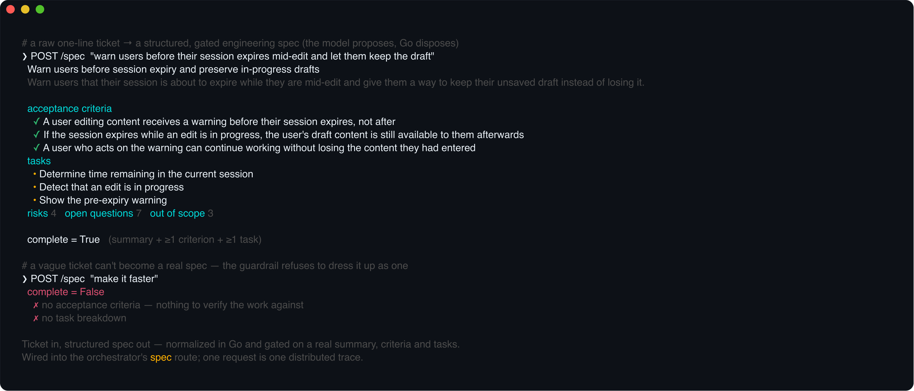
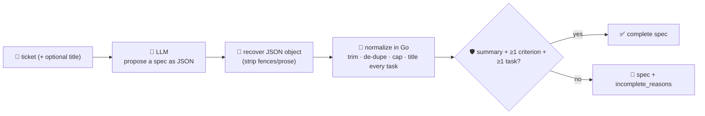

# spec-agent

Turns a raw **ticket or issue** into a **structured engineering spec**: a one-line summary, what's in
and out of scope, **testable acceptance criteria**, risks, a **task breakdown**, and the open
questions that still block the work. Turning a vague request into a scoped, agreed spec is the first
stage of the software-development lifecycle — and the one where an LLM most reliably saves a human
time: it reads the ticket, drafts the shape, and a person edits.

But a spec is only useful if it's actually a spec. A model asked for one will happily return prose,
invent a shape, leave the acceptance criteria empty, or bury a task list inside a sentence. So the
model only proposes: **every section is normalized deterministically in Go** — blanks and duplicates
dropped, each task required to carry a title, lists capped — and the result is **gated on a hard
minimum** (a real summary, at least one acceptance criterion, at least one task) before it's called
`complete`. You get a spec you can hand to a person, with an honest `incomplete_reasons` note about
what the model failed to fill in — never the model's raw guess dressed up as a plan.



## How it works



## Endpoints

| Method | Path | Purpose |
|--------|------|---------|
| POST | `/spec` | `{ticket, title?}` → `{spec, complete, incomplete_reasons, ticket_chars}`. `spec` is the normalized, typed spec; `complete` is `false` (with reasons) when the guardrail's minimum bar isn't met. |

## The spec shape

`title` · `summary` (one line) · `in_scope[]` · `out_of_scope[]` · `acceptance_criteria[]` (each a
concrete, testable condition) · `risks[]` · `tasks[]` (each `{title, detail}`) · `open_questions[]`.
Every list is trimmed, de-duplicated case-insensitively, and capped; every task is dropped unless it
has a title. An optional `title` in the request seeds the spec's title when the model omits one.

## Run

```bash
# keyless (start ../../../localtest/claude-openai-shim first)
cp configs/.env.local configs/.env && go run .

# or with Groq
cp configs/.env.example configs/.env   # add GROQ_API_KEY
go run .
```

## Try it

A one-line ticket becomes a full, structured spec — the model proposes, Go normalizes and gates:

```bash
curl -s localhost:8013/spec -H 'Content-Type: application/json' -d '{
  "ticket": "Users keep losing work when their session expires mid-edit. We should warn them before it happens and let them keep the draft."
}'
# → {"spec":{"title":"Warn users before session expiry and preserve drafts",
#      "summary":"...", "acceptance_criteria":["A warning appears N minutes before expiry", ...],
#      "tasks":[{"title":"Add a session-expiry warning banner","detail":"..."}, ...],
#      "risks":[...], "open_questions":[...]}, "complete":true, "incomplete_reasons":[]}
```

The **guardrail — not the model's discipline — is what makes the output trustworthy**. If the model
returns a thin answer (no criteria, no tasks, an empty summary), it isn't dressed up as a finished
plan: `complete` comes back `false` and `incomplete_reasons` says exactly what's missing, so a caller
(or a downstream agent) can decide whether to send it back or fill the gaps by hand.

```bash
curl -s localhost:8013/spec -d '{"ticket":"make it faster"}'
# → {"spec":{...}, "complete":false,
#      "incomplete_reasons":["no acceptance criteria — nothing to verify the work against"]}
```

See `main_test.go` for the guardrail's unit tests: list normalization (trim/de-dupe/cap), task
coercion (objects *and* bare strings, untitled tasks dropped), the completeness gate, and JSON
recovery from a fenced/prose-wrapped response.

## Customising

Everything is config-driven and generic — no hard-coded model, key, or path:

- **Provider / model** — set `LLM_PROVIDER` / `LLM_MODEL` (+ the provider's key) in `configs/.env`.
  Groq, OpenAI, Ollama, or any OpenAI-compatible endpoint is a one-line swap; the shim needs no key.
- **Guardrail bar** — `maxItems`, `maxTasks`, `maxFieldChars` in `main.go` cap the output; `gate`
  defines what "complete" means (tighten it to require, say, out-of-scope or risks for your team).
- **The spec shape** — add or rename sections in the `spec` struct and the system prompt; the Go
  normalizer treats every list the same way, so a new `string[]` section needs no new plumbing.

## Observability

Every spec is one `llm.chat` span with token metrics, exported by GoFr's configured tracer; routed
through the [orchestrator](../../../orchestrator) it's a child span in that request's distributed trace.
Metrics are scraped on `:2135`, alongside every other agent's `app_llm_request_count`.
