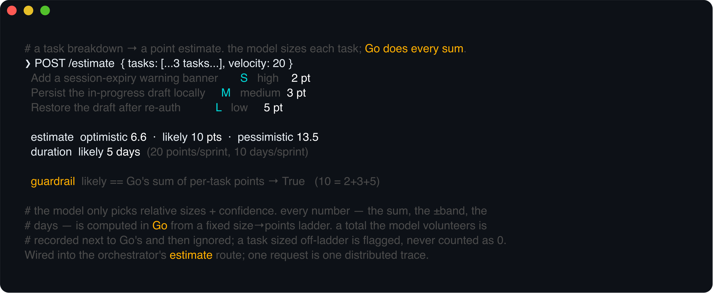
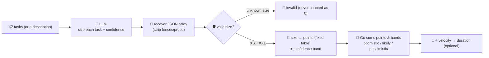

# estimation-agent

Sizes a piece of work. Give it a **task breakdown** (for example the one
[`spec-agent`](../spec-agent) produced) or a raw description, and it returns a **point estimate** with
an optimistic / likely / pessimistic **range** — and, if you tell it the team's **velocity**, a
**duration in working days**. Estimation is the second stage of the software-development lifecycle,
and the one teams most want a second opinion on before they commit to a sprint.

The division of labour is the whole point. A language model is genuinely useful at the *judgment*
part — sizing one task relative to another and saying how confident it is — but **cannot be trusted
with the arithmetic**: models miscount, drop tasks from a sum, and confidently return a total that
doesn't match their own per-task sizes. So the model only proposes a size and a confidence per task;
**every number after that is computed deterministically in Go** from a fixed size→points table. Any
total the model volunteers is recorded next to the one Go computed — and then ignored.



## How it works



## Endpoints

| Method | Path | Purpose |
|--------|------|---------|
| POST | `/estimate` | `{tasks?, text?, velocity?, sprint_days?}` → `{tasks, invalid, estimate, model_claimed_total?, complete}`. Give it `tasks` (`[{title, detail}]`) **or** `text`; `velocity` (points/sprint) adds a duration. |

## The size ladder (fixed, in Go)

`XS`=1 · `S`=2 · `M`=3 · `L`=5 · `XL`=8 · `XXL`=13 story points — a Fibonacci-ish scale (gaps widen
because larger work is inherently less certain). Confidence sets each task's own range: `high` ±10%,
`medium` ±25%, `low` ±50%. The per-task bands are **summed**, so the range reflects *which* tasks are
uncertain — not one blanket fudge factor over the whole estimate. The model never sees these numbers.

## Run

```bash
# keyless (start ../localtest/claude-openai-shim first)
cp configs/.env.local configs/.env && go run .

# or with Groq
cp configs/.env.example configs/.env   # add GROQ_API_KEY
go run .
```

## Try it

Feed it a task breakdown and a velocity — the model sizes, Go does every sum and the duration:

```bash
curl -s localhost:8014/estimate -H 'Content-Type: application/json' -d '{
  "tasks": [
    {"title": "Add a session-expiry warning banner"},
    {"title": "Persist the in-progress draft locally"},
    {"title": "Restore the draft after re-auth"}
  ],
  "velocity": 20
}'
# → {"tasks":[{"title":"...","size":"M","confidence":"high","points":3,"low_points":2.7,"high_points":3.3}, ...],
#     "estimate":{"points":{"optimistic":8.7,"likely":10,"pessimistic":13.3},
#                 "duration":{"optimistic_days":4.4,"likely_days":5,"pessimistic_days":6.7,"assumes":"20 points/sprint, 10 days/sprint"}},
#     "complete":true}
```

The **guardrail — not the model's discipline — is what makes the number trustworthy**:

- a task the model sized `"huge"` (not on the ladder) → **`invalid`**, reported, never counted as `0`
- the **total is always Go's sum** of the per-task points; if the model volunteers its own total it
  comes back as `model_claimed_total` *next to* Go's number, so a mismatch is visible, not hidden
- with no `velocity`, you get points only; with one, the same range is divided through it into days

Routed from the [orchestrator](../orchestrator) (which forwards a single string), it sizes the
description directly — the model breaks it into tasks and sizes each, Go does the rest:

```bash
curl -s localhost:8014/estimate -d '{"text":"Add OAuth login with Google and GitHub, plus account linking."}'
```

See `main_test.go` for the guardrail's unit tests: the size→points mapping, invalid-size handling,
the confidence-band range, the duration division, and the fact that the model's claimed total is
sniffed out and ignored.

## Customising

Everything is config-driven and generic — no hard-coded model, key, or path:

- **Provider / model** — set `LLM_PROVIDER` / `LLM_MODEL` (+ key) in `configs/.env`. Groq, OpenAI,
  Ollama, or any OpenAI-compatible endpoint is a one-line swap; the shim needs no key.
- **The ladder** — `sizePoints` and `confBand` in `main.go` are the estimation policy. Switch to a
  linear scale, add a `XXXL`, or widen the low-confidence band to match how your team actually sizes.
- **Sprint shape** — `sprint_days` per request (default 10) and `velocity` are the team's numbers;
  nothing about them is baked in.

## Observability

Every estimate is one `llm.chat` span with token metrics, exported by GoFr's configured tracer;
routed through the orchestrator it's a child span in that request's distributed trace. Metrics are
scraped on `:2136`, alongside every other agent's `app_llm_request_count`.
