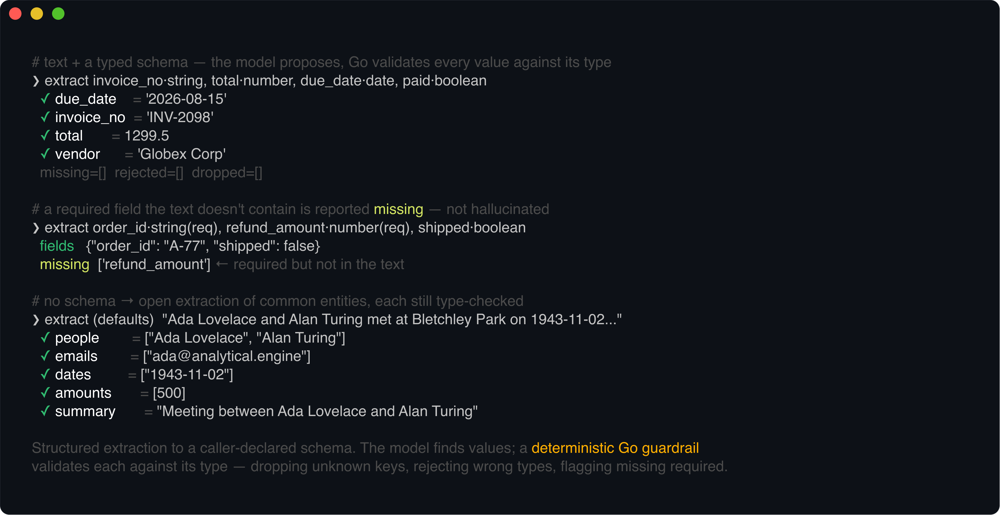
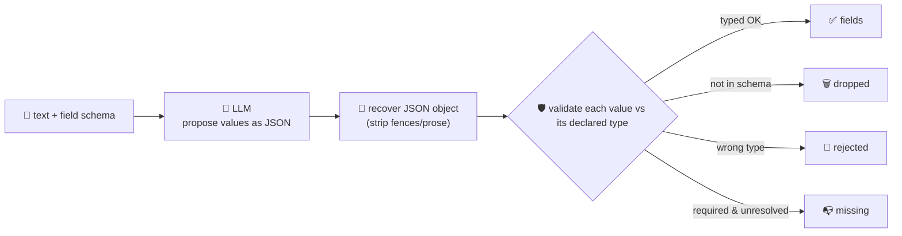

# extraction-agent

Turns unstructured text into **structured, typed JSON** against a schema you declare. Give it some
text and a list of fields — each with a name and a type (`string`, `integer`, `number`, `boolean`,
`date`, or a list like `string[]`) — and it returns only values that actually match those types.
Structured extraction ("structured output": invoice/receipt parsing, resume and contract fields,
entity extraction, unstructured-to-structured ETL) is the single most widely deployed LLM pattern in
production right now — the engine behind "chat with your documents" and form auto-fill.

A language model is good at *finding* values but can't be trusted to *shape* them — it invents keys,
returns the wrong type, or wraps its JSON in prose. So the model only proposes: **every value it
returns is validated deterministically in Go** against the requested schema before it leaves the
service. Keys you didn't ask for are dropped, values that don't match their declared type are
rejected, and required fields that never resolved are reported as missing. You get typed data you can
rely on — never the model's raw guess.



## How it works



## Endpoints

| Method | Path | Purpose |
|--------|------|---------|
| POST | `/extract` | `{text, fields?}` → `{fields, missing, dropped, rejected, schema}`. `fields` is the validated, correctly-typed data; with no `fields` schema the agent extracts a default set of common entities. |

## Field types

`string` · `integer` · `number` · `boolean` · `date` (any common format, normalized to `YYYY-MM-DD`)
· and a list of any of these written `<type>[]` (e.g. `string[]`, `number[]`). Mark a field
`"required": true` to have it reported under `missing` when it can't be resolved to a valid value.

## Run

```bash
# keyless (start ../localtest/claude-openai-shim first)
cp configs/.env.local configs/.env && go run .

# or with Groq
cp configs/.env.example configs/.env   # add GROQ_API_KEY
go run .
```

## Try it

Targeted extraction against an explicit schema — the model proposes, Go validates the types:

```bash
curl -s localhost:8009/extract -H 'Content-Type: application/json' -d '{
  "text": "Invoice INV-2098 from Globex Corp is due 2026-08-15 for a total of $1,299.50. Status: unpaid.",
  "fields": [
    {"name": "invoice_no", "type": "string",  "required": true},
    {"name": "vendor",     "type": "string"},
    {"name": "total",      "type": "number",  "required": true},
    {"name": "due_date",   "type": "date"},
    {"name": "paid",       "type": "boolean"}
  ]
}'
# → {"fields":{"invoice_no":"INV-2098","vendor":"Globex Corp","total":1299.5,
#      "due_date":"2026-08-15","paid":false}, "missing":[], "dropped":[], "rejected":[]}
```

The guardrail — not the model's discipline — is what makes the output trustworthy. A model that
hallucinates an extra key, answers the wrong type, or omits a required field is corrected
deterministically:

- a key you didn't request → **`dropped`**, never returned as data
- a value that isn't a valid instance of its type (e.g. `"soon"` for a `date`) → **`rejected`**
- a `required` field that's absent, null, or invalid → **`missing`**

With no `fields` schema, it does open extraction of common entities (people, organizations, emails,
dates, amounts, a summary) — which keeps it routable from the [orchestrator](../orchestrator), whose
router only forwards a single query string:

```bash
curl -s localhost:8009/extract -d '{"text":"Ada Lovelace and Alan Turing met at Bletchley Park on 1943-11-02 to discuss a £500 grant."}'
# → {"fields":{"summary":"...","people":["Ada Lovelace","Alan Turing"],"dates":["1943-11-02"],"amounts":[500], ...}, ...}
```

See `main_test.go` for the guardrail's unit tests: JSON recovery from a fenced/prose-wrapped
response, per-type coercion (including list handling and date normalization), and the full
validate → fields/missing/dropped/rejected split.

## Observability

Every extraction is one `llm.chat` span with token metrics, exported by GoFr's configured tracer;
routed through the orchestrator it's a child span in that request's distributed trace. Metrics are
scraped on `:2131`, alongside every other agent's `app_llm_request_count`.
