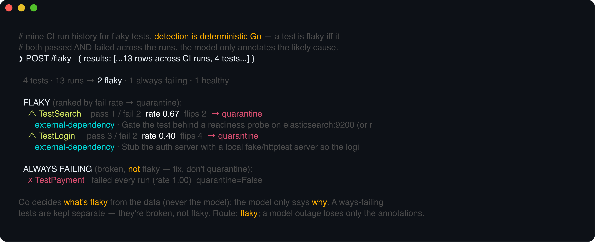
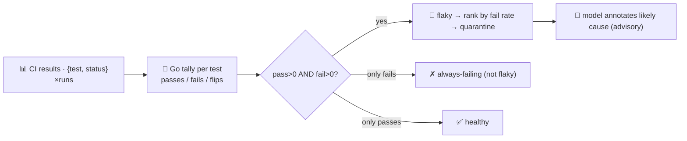

# flaky-test-agent

Mines **CI run history** for flaky tests and recommends **quarantine**. A flaky test is one that both
passes and fails across runs of the same code — the most corrosive thing in a suite, because it trains
everyone to ignore red. Give it a list of `{test, status}` rows across your recent CI runs and it tells
you which tests are flaky, ranks them, and separates out the ones that are simply **broken**.

This agent deliberately **inverts the usual pattern**. Everywhere else the model proposes and Go
disposes; here the **detection is the deterministic part and lives entirely in Go**. A test is flaky
**iff, in the runs you provide, it has at least one pass AND at least one fail** — that's arithmetic
over the data, not a judgement call, so **the model never gets to decide what's flaky**. The model's
role is narrow and advisory: given the failure messages, it annotates each *already-detected* flaky
test with a likely-cause category and a one-line fix. **If the model is unavailable, the detection,
ranking and quarantine list still stand** — you just lose the annotations.



## How it works



## Endpoints

| Method | Path | Purpose |
|--------|------|---------|
| POST | `/flaky` | `{results:[{test, status, run?, message?}]}` → `{summary, flaky, always_failing, note}`. `flaky` is ranked by fail rate, each with `passed/failed/fail_rate/flips/quarantine` and (advisory) `likely_cause/suggestion`. |

Status accepts the usual CI spellings — `pass`/`passed`/`ok`/`success` and `fail`/`failed`/`error`;
anything else is ignored. `run` is an optional label; flips (pass↔fail transitions) are counted in the
order rows appear.

## The guardrail

- **Deterministic detection** — flaky, always-failing and healthy are decided by counting, in Go. A
  test that only ever failed is reported under `always_failing` with `quarantine: false` — it's
  **broken, not flaky**, and quarantining it would hide a real failure.
- **Advisory annotation** — the model only labels a *likely cause* (`timing/race`,
  `external-dependency`, `test-ordering`, `resource/environment`, `nondeterministic-data`) and suggests
  a fix, over the tests Go already flagged. A model error is logged and the response is returned without
  annotations — the verdicts don't change.

## Run

```bash
# keyless (start ../localtest/claude-openai-shim first)
cp configs/.env.local configs/.env && go run .

# or with Groq
cp configs/.env.example configs/.env   # add GROQ_API_KEY
go run .
```

## Try it

Feed it a few runs' worth of results — Go finds the flaky ones, the model explains them:

```bash
curl -s localhost:8018/flaky -H 'Content-Type: application/json' -d '{"results":[
  {"test":"TestLogin","status":"pass"},
  {"test":"TestLogin","status":"fail","message":"context deadline exceeded waiting for auth server"},
  {"test":"TestLogin","status":"pass"},
  {"test":"TestPayment","status":"fail","message":"nil pointer in charge()"},
  {"test":"TestPayment","status":"fail","message":"nil pointer in charge()"}
]}'
# → {"summary":{"tests":2,"runs_observed":5,"flaky":1,"always_failing":1,"healthy":0},
#     "flaky":[{"test":"TestLogin","passed":2,"failed":1,"fail_rate":0.33,"flips":2,"quarantine":true,
#               "likely_cause":"external-dependency","suggestion":"stub the auth server / add a readiness wait"}],
#     "always_failing":[{"test":"TestPayment","failed":2,"fail_rate":1.0,"quarantine":false}]}
```

`TestPayment` failed **every** run, so it's reported as **broken, not flaky** — the guardrail won't let
you quarantine a genuine failure. See `main_test.go` for the detection tests: flaky vs
always-failing vs healthy classification, flip counting, fail-rate ranking, status normalization, and
message de-duplication.

## Customising

- **Provider / model** — set `LLM_PROVIDER` / `LLM_MODEL` (+ key) in `configs/.env`. The annotation is
  best-effort, so any OpenAI-compatible endpoint works; the shim needs no key.
- **Quarantine policy** — today any flaky test is a quarantine candidate. Tighten `analyze` to gate on
  a minimum run count or a fail-rate band (e.g. only `0.05 < rate < 0.95`) to match your team's bar.
- **Input format** — `resultRow` + `normStatus` map your CI's export into `{test, status}`; point them
  at JUnit XML, `go test -json`, or your provider's API by adapting the parse.

## Observability

Every request is one `llm.chat` span (the annotation) with token metrics, exported by GoFr's tracer;
routed through the [orchestrator](../orchestrator) it's a child span in that request's distributed
trace. Metrics are scraped on `:2140`, alongside every other agent's `app_llm_request_count`.
