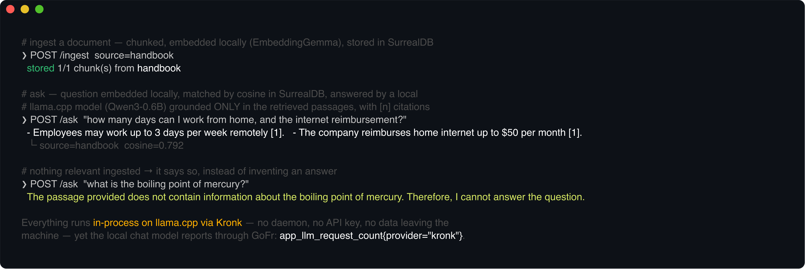
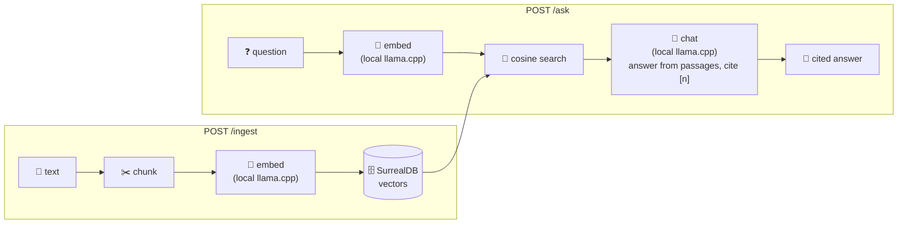

# local-rag-agent

A **100% local** retrieval-augmented-generation agent on GoFr 1.58. Both models run **in-process on
llama.cpp** via [Kronk](https://github.com/ardanlabs/kronk) (GGUF, no daemon, no HTTP, no API key),
and document vectors live in **SurrealDB** — used here as a vector database through GoFr's datasource.
Ingest text and it's chunked, embedded and stored; ask a question and it's embedded, matched by
cosine similarity, and answered by the local chat model **grounded only in the retrieved passages**,
with `[n]` citations.

Nothing leaves the machine — no prompt, no document, no embedding is sent to any hosted provider —
**yet the local model still gets GoFr's tracing, token metrics and health check**, because it's
registered as a custom `ai.Model` via `app.AddLLM` and used through `ctx.LLM()`. That's the point of
this agent: it shows GoFr's LLM instrumentation working over an engine that isn't an HTTP API at all.



## How it works



Everything in the boxes runs on-device. The chat step goes through `ctx.LLM()`, so it's traced and
metered by GoFr exactly like a hosted provider would be.

## Endpoints

| Method | Path | Purpose |
|--------|------|---------|
| POST | `/ingest` | `{text, source?}` → chunk, embed locally, store in SurrealDB. Returns `{source, chunks_ingested, chunks_total}`. |
| POST | `/ask` | `{question, k?}` → embed the question, retrieve the `k` most similar chunks, answer grounded in them. Returns `{question, answer, sources[]}` with each source's cosine `score`. |

## Run

You need a SurrealDB for the vectors (the models download themselves on first run):

```bash
# 1 · a throwaway SurrealDB (in-memory) — the agent provisions its namespace/database itself
docker run --rm -p 8000:8000 surrealdb/surrealdb:latest start --user root --pass root memory

# 2 · run the agent (first start downloads the llama.cpp backend + both GGUF models, a few hundred MB)
cp configs/.env.local configs/.env && go run .
```

```bash
# ingest a document, then ask about it
curl -s localhost:8010/ingest -H 'Content-Type: application/json' \
  -d '{"source":"handbook","text":"Employees may work remotely up to three days per week. The company reimburses home internet up to 50 dollars per month."}'

curl -s localhost:8010/ask -H 'Content-Type: application/json' \
  -d '{"question":"How many days can I work from home?"}'
# → {"answer":"Employees may work up to 3 days per week remotely [1].",
#    "sources":[{"source":"handbook","score":0.79,"content":"..."}]}
```

With nothing relevant ingested it says so — it never answers from outside the retrieved passages.

## Customising

Everything is driven by environment config (`configs/.env`), so the same binary runs against whatever
models and store you point it at — no code changes.

| Variable | Default | What it does |
|----------|---------|--------------|
| `CHAT_MODEL` | `unsloth/Qwen3-0.6B-Q8_0.gguf` | The local chat model. **Any GGUF Kronk can resolve** — a Hugging Face ref (`owner/repo` or `owner/repo/file.gguf`) or an absolute path to a local `.gguf`. |
| `EMBED_MODEL` | `ggml-org/embeddinggemma-300m-qat-Q8_0.gguf` | The local embedding model (same source rules). Must be an embedding model. |
| `CHAT_MAX_TOKENS` | `512` | Max tokens generated per answer. |
| `ENABLE_THINKING` | `false` | For reasoning models (e.g. Qwen3), `true` keeps the `<think>` block; `false` asks for a direct answer. Ignored by non-reasoning models. |
| `CHAT_CONTEXT` | model default | Override the chat model's context window (tokens). |
| `RECALL_FLOOR` | `0` | Minimum cosine similarity a chunk needs to be used. Raise it (e.g. `0.35`) to drop weak matches; `0` keeps the top-k. |
| `CHAT_MAX_TOKENS` / `CHAT_TIMEOUT_SEC` / `EMBED_TIMEOUT_SEC` | `512` / `120` / `60` | Generation cap and per-call timeouts. |
| `SURREAL_HOST` / `SURREAL_PORT` | `localhost` / `8000` | SurrealDB location. |
| `SURREAL_USER` / `SURREAL_PASS` | `root` / `root` | SurrealDB credentials. |
| `SURREAL_NS` / `SURREAL_DB` | `agents` / `rag` | Namespace/database (auto-created on start). |

### Swap in a bigger/better model

```dotenv
# more capable answers (more RAM, slower on CPU-only machines)
CHAT_MODEL=unsloth/Qwen2.5-3B-Instruct-GGUF
CHAT_MAX_TOKENS=1024

# or a model file you already have on disk
CHAT_MODEL=/Users/me/models/Llama-3.2-3B-Instruct-Q4_K_M.gguf
```

The first run for a new model downloads it (Kronk caches it); subsequent runs load from cache. The
llama.cpp backend is installed once and reused across models.

## Observability

The chat model is registered with `app.AddLLM`, so every answer is a GoFr `llm.chat` span with token
metrics, exported by the configured tracer — even though inference is a local `.gguf`, not an API
call. Metrics are scraped on `:2132`; the local model shows up as
`app_llm_request_count{provider="kronk", model="<your model>"}` alongside every other agent's LLM
metrics. SurrealDB and the model both report on GoFr's health endpoint.

## Notes

- **Fully offline after the first download.** No provider key exists to set — inference and embedding
  both run in this process.
- **`ai.Model` extension point.** `kronk.go` implements GoFr's `ai.Model` (and `ai.Descriptor`)
  around Kronk; that's all it takes to make a non-HTTP engine a first-class GoFr LLM.
- **Vector DB.** `vector.go` stores each chunk with its embedding and ranks by
  `vector::similarity::cosine` in SurrealDB. See `main_test.go` for the pure-logic tests (chunking,
  the SurrealQL vector literal, row decoding).
