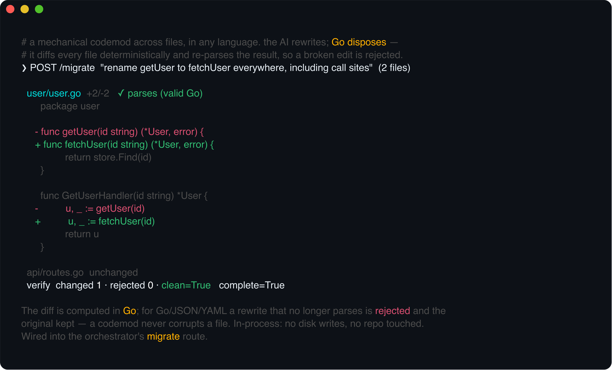
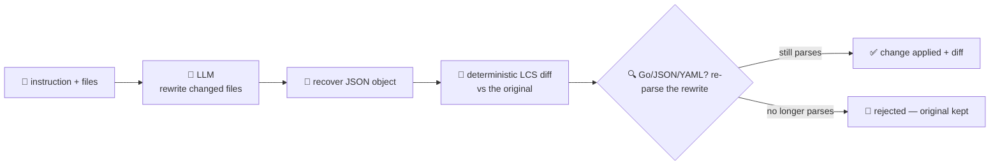

# migration-agent

Applies a **mechanical codemod across a set of files — in any language — and verifies it didn't break
them**. Give it an instruction (`"rename getUser to fetchUser everywhere"`, `"replace the deprecated
ioutil calls"`, `"add this license header"`) and the files, and it returns the rewritten files with a
**per-file diff**. Migrations and codemods are the maintenance work of the software-development
lifecycle — the tedious, repo-wide, mechanical edits.

A model is good at *proposing* the edit but can't be trusted that the result still holds together: it
drops a brace, mangles a string, or "helpfully" rewrites more than you asked. So the model only
proposes new file content; **Go disposes**:

- it computes a **deterministic diff** (an LCS line diff) between the original and the rewrite, so you
  see exactly what changed — a model that quietly rewrote an unrelated line is **visible, not hidden**;
- for the file types it can parse — **Go** (`go/format.Source`), **JSON**, **YAML** — it **re-parses
  the rewrite**, and if the codemod produced something that no longer parses it **rejects the change
  and keeps the original**.

That last rule is the whole point: **a migration must never leave a file worse than it found it**. It's
all in-process — no disk writes, no repo touched — so you get back the rewritten content and diffs to
apply yourself.



## How it works



## Endpoints

| Method | Path | Purpose |
|--------|------|---------|
| POST | `/migrate` | `{instruction, files:[{path, content}]}` → `{files, skipped, verify, complete}`. Each file carries `{path, changed, checked, valid, rejected?, added_lines, removed_lines, diff, content}`; `verify` reports `files_changed` / `files_rejected` / `clean`; `complete` is true when something changed and nothing was rejected. |

## The guardrail

- **Deterministic diff** — the diff is computed in Go with an LCS line algorithm and collapsed to the
  changed hunks (a few lines of context, unchanged runs shown as `...`). It's the model's output
  measured against the original, so nothing the model did is taken on trust.
- **Re-parse verification** — a rewritten `.go` file goes through `go/format.Source`, `.json` through
  `encoding/json`, `.yaml`/`.yml` through `yaml.v3`. If the rewrite no longer parses, the file comes
  back `rejected: true` with the reason and its **original content** — the codemod is refused for that
  file. Files in a language we can't parse here are diffed and applied but marked `checked: false`.
- **Path safety** — every input path must be relative and in-root; absolute/traversal paths are
  skipped. File count and per-file size are capped.

## Run

```bash
# keyless (start ../localtest/claude-openai-shim first)
cp configs/.env.local configs/.env && go run .

# or with Groq
cp configs/.env.example configs/.env   # add GROQ_API_KEY
go run .
```

## Try it

Rename a function across files — the model rewrites, Go diffs and re-verifies each:

```bash
curl -s localhost:8016/migrate -H 'Content-Type: application/json' -d '{
  "instruction": "Rename the function getUser to fetchUser everywhere, including call sites.",
  "files": [
    {"path":"user/user.go","content":"package user\n\nfunc getUser(id string) (*User, error) { return store.Find(id) }\n"},
    {"path":"api/routes.go","content":"package api\n// ... calls user.GetUserHandler ...\n"}
  ]
}'
# → {"files":[
#      {"path":"user/user.go","changed":true,"checked":true,"valid":true,"added_lines":1,"removed_lines":1,
#       "diff":"- func getUser(...)\n+ func fetchUser(...)\n","content":"...new..."},
#      {"path":"api/routes.go","changed":false,"content":"...original..."}],
#     "verify":{"files_changed":1,"files_rejected":0,"clean":true}, "complete":true}
```

The **guardrail — not the model's discipline — is what makes it safe to apply**: if the model's
rewrite of a `.go`/`.json`/`.yaml` file no longer parses, that file comes back `rejected: true` with
the **original** content (never the broken version), `clean` is `false`, and you know the migration
wasn't applied there. See `main_test.go` for the unit tests: the LCS diff (counts + collapsed hunks),
per-type re-parse verification, the reject-and-keep-original path, input path safety, and dedupe.

> Routed from the [orchestrator](../orchestrator) (which forwards a single string) it receives only
> the instruction, so a codemod is best driven by a direct call that carries the `files`.

## Customising

Everything is config-driven and generic — no hard-coded model, key, path, or language:

- **Provider / model** — set `LLM_PROVIDER` / `LLM_MODEL` (+ key) in `configs/.env`. Groq, OpenAI,
  Ollama, or any OpenAI-compatible endpoint is a one-line swap; the shim needs no key.
- **What it verifies** — `verifyType` in `main.go` maps extensions to parsers. Add a language by
  wiring in its checker (e.g. shell out to `tsc --noEmit`, `python -m py_compile`, `cargo check`) to
  extend the "must still parse" guarantee beyond Go/JSON/YAML.
- **Diff + caps** — `diffContext`, `maxDiffLines`, `maxFiles`, `maxFileBytes` tune the diff detail and
  the safety caps.

## Observability

Every migration is one `llm.chat` span with token metrics, exported by GoFr's configured tracer;
routed through the orchestrator it's a child span in that request's distributed trace. Metrics are
scraped on `:2138`, alongside every other agent's `app_llm_request_count`.
