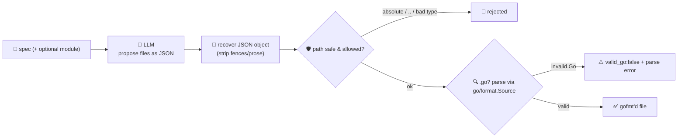

# scaffold-agent

Generates a **runnable GoFr service/module skeleton** from a one-line spec. Give it
`"an HTTP service that tracks orders with POST /orders and GET /orders/{id}"` and it returns the
files — `main.go` with the routes the spec implies, a `go.mod`, a test — ready to drop into a new
module. Scaffolding is the **build** stage of the software-development lifecycle: the repetitive first
hour of a new service, done in seconds.

The catch is that generated code is only worth anything if it's **real code**. A model will happily
emit a file that's truncated, syntactically broken, or written to `../../etc/passwd`. So the model
only proposes files; **Go disposes of the unsafe and the unusable** before anything leaves the
service:

- **every path is sanitized** — absolute paths, `..`, anything that escapes the scaffold root, and
  non-whitelisted file types are **rejected** (a filesystem analogue of the SSRF guardrail the fetch
  agents use);
- **every `.go` file is run through `go/format.Source`**, which parses it — a file that isn't valid
  Go is **rejected with the parse error**, and the ones that survive come back correctly **gofmt'd**.

It's all **in-process** — no disk writes, no `go build`, no network — so the agent **never touches
your repo and never blocks**. You get back a verified set of files (and an honest list of what was
rejected), which you can write to a new directory yourself.


## How it works



## Endpoints

| Method | Path | Purpose |
|--------|------|---------|
| POST | `/scaffold` | `{spec, module?}` → `{module, files, rejected, verify, complete}`. `files` each carry `{path, content, bytes, valid_go}`; `verify` reports `all_go_valid` / `has_main` / `has_go_mod`; `complete` is true only when all three hold. |

## The guardrail

- **Path safety** — a path must be relative and stay inside the scaffold root. Absolute paths, drive
  letters, and any `..` that climbs out are rejected; interior `..` that stays in-root is collapsed.
  Only a whitelist of extensions (`.go`, `.md`, `.yml`, `.env`, `.json`, `.txt`, `go.mod`, `go.sum`)
  is allowed. File count and per-file size are capped.
- **Go verification** — each `.go` file goes through `go/format.Source`. That call **parses** the
  source, so anything syntactically broken is caught (`valid_go: false`, with the parser's error), and
  valid files are returned re-formatted. This is a syntax/format guarantee, not a full type-check
  build — deliberately, so it stays in-process, instant, and safe to run anywhere.

## Run

```bash
# keyless (start ../localtest/claude-openai-shim first)
cp configs/.env.local configs/.env && go run .

# or with Groq
cp configs/.env.example configs/.env   # add GROQ_API_KEY
go run .
```

## Try it

A one-line spec becomes a verified, multi-file skeleton:

```bash
curl -s localhost:8015/scaffold -H 'Content-Type: application/json' -d '{
  "spec": "An HTTP service that tracks orders: POST /orders creates one, GET /orders/{id} fetches it.",
  "module": "github.com/acme/orders"
}'
# → {"module":"github.com/acme/orders",
#     "files":[{"path":"main.go","valid_go":true,"content":"package main\n\nimport ..."}, {"path":"go.mod",...}, ...],
#     "verify":{"all_go_valid":true,"has_main":true,"has_go_mod":true}, "rejected":[], "complete":true}
```

Write the returned files out and it runs — nothing was written for you:

```bash
curl -s localhost:8015/scaffold -d '{"spec":"..."}' \
  | jq -r '.data.files[] | "=== \(.path) ===\n\(.content)"'   # inspect, then redirect into a new dir
```

The **guardrail — not the model's discipline — is what makes the output safe**: a path like
`../secrets.go` comes back under `rejected` (never in `files`), and a `.go` file the model truncated
comes back with `valid_go: false` and the parse error, so `complete` is `false` and you know not to
trust it. See `main_test.go` for the unit tests: path traversal/absolute/drive-letter/extension
rejection, `go/format.Source` verification (valid reformatted, broken flagged), duplicate handling,
and JSON recovery.

## Customising

Everything is config-driven and generic — no hard-coded model, key, or path:

- **Provider / model** — set `LLM_PROVIDER` / `LLM_MODEL` (+ key) in `configs/.env`. Groq, OpenAI,
  Ollama, or any OpenAI-compatible endpoint is a one-line swap; the shim needs no key.
- **What it generates** — the system prompt defines the skeleton (GoFr service by default). Point it
  at a different framework, a CLI, or a library layout by editing that one prompt.
- **Guardrail policy** — `allowedExt`, `maxFiles`, `maxFileBytes` in `main.go` set the file whitelist
  and caps; `safePath` is the traversal guard; `verifyFile` is where you'd add a stricter check
  (e.g. an actual `go build` in a temp module) if you want type-level verification.

## Observability

Every scaffold is one `llm.chat` span with token metrics, exported by GoFr's configured tracer;
routed through the [orchestrator](../orchestrator) it's a child span in that request's distributed
trace. Metrics are scraped on `:2137`, alongside every other agent's `app_llm_request_count`.
