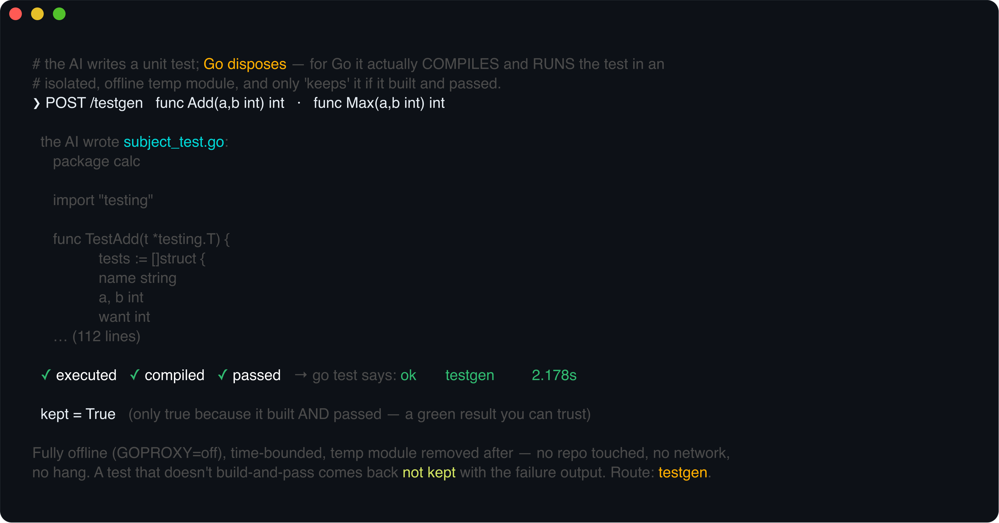
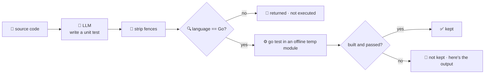

# test-gen-agent

Writes unit tests for a piece of code — and, for Go, **compiles and runs them to prove they pass
before keeping them**. Give it a source file and it returns a generated test; but for Go it doesn't
just hand back what the model wrote — it writes the test next to the source in an isolated temp module,
runs `go test`, and reports whether it **built** and **passed**. Test generation is a stage of the
software-development lifecycle where an *unverified* answer is worse than none: a test that doesn't
compile, or one that passes vacuously, is a trap.

So the model only proposes a test; **Go disposes** — it actually runs it, fully offline
(`GOPROXY=off`, a hard timeout, no toolchain download), so the agent **can't hang or reach the
network**. A test that fails to build or fails to pass is returned **with its output and marked NOT
kept** — you see exactly why, and you never get a green result you can't trust. Other languages get a
generated test too, honestly marked *not executed* (only Go is run here). **Nothing is written to your
repo**; the temp module is created and removed per request.



## How it works



## Endpoints

| Method | Path | Purpose |
|--------|------|---------|
| POST | `/testgen` | `{code, language?}` → `{language, test:{filename, content}, verify:{executed, compiled, passed, output}, kept}`. For Go, `verify` reports a real `go test` run; `kept` is true only when it compiled **and** passed. Other languages: `executed:false`, `kept:false`. |

## The guardrail

- **Real execution (Go)** — the generated test is written with the source into a throwaway module and
  run with `go test`. `compiled` and `passed` come from the actual run, not a parse. `kept` = built and
  passed.
- **Bounded execution** — `GOPROXY=off` (no downloads — a source that imports a third-party package is
  reported as a build failure rather than triggering a fetch), `CGO_ENABLED=0`, `GOTOOLCHAIN=local`,
  `GOWORK=off`, a 30s timeout that kills the **whole process group** (a runaway test can't outlive the
  deadline as an orphan), and the temp dir is removed after each request. No repo writes, no network.

> ⚠️ **Security — this agent runs model-generated code.** The offline/timeout controls bound *module
> fetching* and *wall-time*, **not what the compiled test can do**: it runs with the agent's own
> privileges and is **not sandboxed** (no container / seccomp / user isolation). A generated test could
> touch the filesystem or spin CPU/memory for up to the timeout. **Run this only on source you trust**,
> in a dev/CI context you control. True sandboxing (a container or microVM per run) is the right
> production hardening and is a deliberate follow-up.
- **Honest about the rest** — non-Go tests are generated but returned `executed:false`, because this
  service only runs Go. You still get the test; you just know it wasn't verified here.

## Run

```bash
# keyless (start ../localtest/claude-openai-shim first) — needs the Go toolchain on PATH to run tests
cp configs/.env.local configs/.env && go run .

# or with Groq
cp configs/.env.example configs/.env   # add GROQ_API_KEY
go run .
```

## Try it

Give it a Go function; the returned test was actually compiled and run:

```bash
curl -s localhost:8017/testgen -H 'Content-Type: application/json' -d '{
  "code": "package calc\n\nfunc Add(a, b int) int { return a + b }\nfunc Div(a, b int) (int, error) {\n\tif b == 0 { return 0, fmt.Errorf(\"divide by zero\") }\n\treturn a / b, nil\n}\n"
}'
# → {"language":"go","test":{"filename":"subject_test.go","content":"package calc\n\nimport \"testing\"..."},
#     "verify":{"executed":true,"compiled":true,"passed":true,"output":"ok  \ttestgen\t0.2s\n"},
#     "kept":true}
```

The **guardrail — not the model's confidence — is what makes a green result mean something**. If the
model writes a test that references a function that doesn't exist, or asserts the wrong result, you
don't get a false "here's your test": `kept` comes back `false`, `verify.compiled` / `verify.passed`
tell you which failed, and `verify.output` is the real `go test` output. See `main_test.go` — its
integration tests shell out to `go test` exactly as the handler does, covering the pass, the
assertion-failure, and the doesn't-compile cases.

## Customising

- **Provider / model** — set `LLM_PROVIDER` / `LLM_MODEL` (+ key) in `configs/.env`. Groq, OpenAI,
  Ollama, or any OpenAI-compatible endpoint is a one-line swap; the shim needs no key.
- **Run more languages** — `runGoTest` is the Go runner; add a runner for another language (e.g.
  `pytest` in a venv, `node --test`) and dispatch on `lang` in `testgen` to extend real execution
  beyond Go. Keep the same offline/timeout discipline.
- **Limits** — `testTimeout` and `maxCodeChars` bound the run and the input.

## Observability

Every request is one `llm.chat` span with token metrics, exported by GoFr's configured tracer; routed
through the [orchestrator](../orchestrator) it's a child span in that request's distributed trace.
Metrics are scraped on `:2139`, alongside every other agent's `app_llm_request_count`.
